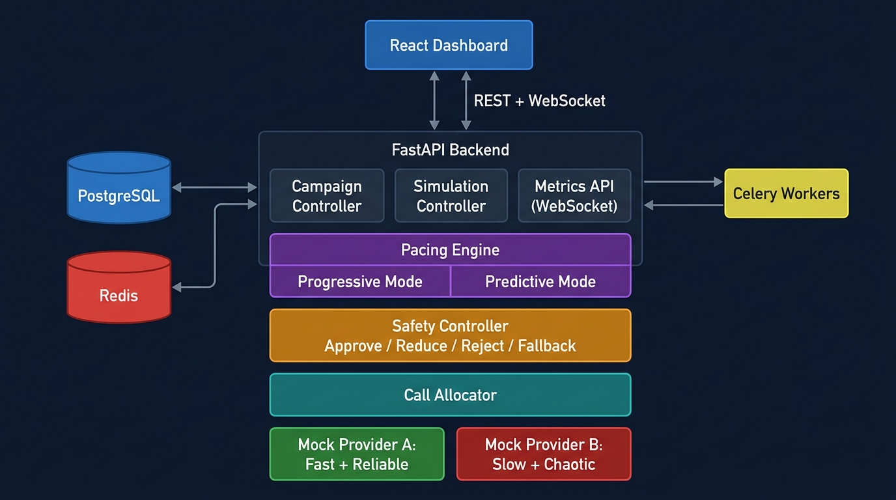

# 📞 SmartDialer

[](https://python.org)
[](https://fastapi.tiangolo.com)
[](https://reactjs.org)
[](https://postgresql.org)
[](https://redis.io)
[](https://docker.com)

> A functional prototype of a smart outbound call dialer with **Progressive** and **Predictive** modes, built for collections call-center environments. Demonstrates agent lifecycle management, distributed concurrency safety, pacing algorithms, and graceful failure handling — all with a live React dashboard.

---

## Table of Contents

- [Overview](#overview)
- [Features](#features)
- [Tech Stack](#tech-stack)
- [Architecture](#architecture)
- [Project Structure](#project-structure)
- [Getting Started](#getting-started)
- [Running Without Docker](#running-without-docker)
- [Running Simulations](#running-simulations)
- [Running Tests](#running-tests)
- [Failure Scenarios](#failure-scenarios)
- [Documentation](#documentation)
- [Branching Strategy](#branching-strategy)
- [Evaluation Coverage](#evaluation-coverage)
- [Core Design Question](#core-design-question)
- [License](#license)

---

## Overview

Collections agents waste time waiting for calls to connect or sitting idle. SmartDialer solves this with two dialing modes:

**Progressive Dialing** — 1 available agent = 1 outbound call. Safe, predictable, no abandoned calls.

**Predictive Dialing** — Starts calls slightly ahead of agent availability based on historical answer rates. Improves utilization but requires safety enforcement.

Every dial request flows through this pipeline — the Pacing Engine can **never** call the telecom provider directly:

```
Campaign → Pacing Engine (Progressive / Predictive) → Safety Controller → Call Allocator → Telecom Provider
```

The **Safety Controller** can approve, reduce, reject, or fall back to progressive mode. This is the architectural guarantee that makes predictive dialing safe.

---

## Features

- ⚡ **Progressive Mode** — strict 1:1 agent-to-call mapping with full lifecycle management
- 🧠 **Predictive Mode** — rule-based pacing using answer rate, provider health, and call timing
- 🛡️ **Safety Controller** — hard gate between pacing engine and provider; cannot be bypassed
- 📞 **Mock Provider A** — fast, reliable, low failure rate
- 🔥 **Mock Provider B** — slow, chaotic, duplicate/out-of-order events
- 📊 **Live React Dashboard** — real-time metrics via WebSocket, agent pool, pacing charts, safety log
- 💥 **5 Failure Scenarios** — triggerable from the dashboard (worker crash, outage, agent drop, duplicates, out-of-order)
- 🔄 **Idempotent State Machines** — duplicate and out-of-order provider events handled gracefully
- 🔒 **Concurrency Safety** — `SELECT FOR UPDATE SKIP LOCKED` prevents double agent reservation
- 🧪 **Tests** — unit + integration (pytest), load test (Locust)

---

## Tech Stack

| Layer | Technology | Purpose |
|---|---|---|
| **Backend** | FastAPI 0.104+ | Async REST API + WebSocket server |
| | PostgreSQL 15 | ACID-safe agent/call state storage |
| | Redis 7 | Pub/Sub event bus + in-memory state cache |
| | Celery 5.3 | Distributed worker coordination |
| | SQLAlchemy 2.0 (async) | ORM with async support |
| | Alembic | Database migrations |
| **Frontend** | React 18 + Vite 5 | Modern SPA with fast HMR |
| | Tailwind CSS 3.4 | Utility-first styling |
| | shadcn/ui | Accessible, polished component library |
| | Recharts 2.x | Animated real-time charts |
| **Dev/Infra** | Docker Compose 3.8 | One-command local setup |
| | pytest 7.x | Unit and integration tests |
| | Locust 2.x | Load testing |

---

## Architecture



Full design documents:
- [High Level Design](./docs/HLD.md)
- [Low Level Design](./docs/LLD.md)
- [Technical Requirements](./docs/TRD.md)

---

## Project Structure

```
smart_dialer/
├── backend/
│   ├── app/
│   │   ├── main.py                  # FastAPI app entry point
│   │   ├── config.py                # Settings & env vars
│   │   ├── database.py              # Async DB session
│   │   ├── models/                  # SQLAlchemy ORM models
│   │   │   ├── agent.py             # Agent + state machine
│   │   │   ├── call.py              # Call + state machine
│   │   │   ├── campaign.py
│   │   │   └── borrower.py
│   │   ├── schemas/                 # Pydantic request/response schemas
│   │   ├── routers/                 # FastAPI route handlers
│   │   │   ├── agents.py
│   │   │   ├── calls.py
│   │   │   ├── campaigns.py
│   │   │   ├── simulation.py
│   │   │   └── metrics.py
│   │   ├── services/                # Core business logic
│   │   │   ├── pacing_engine.py     # Progressive + Predictive pacing
│   │   │   ├── safety_controller.py # Safety validation gate
│   │   │   ├── call_allocator.py    # Agent-call-provider binding
│   │   │   ├── answer_rate_tracker.py
│   │   │   └── provider_health.py
│   │   ├── providers/               # Telecom provider abstraction
│   │   │   ├── base.py              # TelecomProvider interface
│   │   │   ├── provider_a.py        # Fast + reliable mock
│   │   │   └── provider_b.py        # Slow + chaotic mock
│   │   ├── workers/
│   │   │   ├── celery_app.py
│   │   │   ├── dialer_worker.py     # Main dialing loop
│   │   │   └── heartbeat.py         # Crash recovery
│   │   └── websocket/
│   │       └── metrics_ws.py        # Real-time metrics broadcaster
│   ├── alembic/                     # DB migration scripts
│   ├── tests/                       # pytest test suite
│   ├── Dockerfile
│   └── requirements.txt
├── frontend/
│   ├── src/
│   │   ├── App.tsx
│   │   ├── components/
│   │   │   ├── Dashboard/           # Main layout
│   │   │   ├── AgentPool/           # Live agent state breakdown
│   │   │   ├── CallMetrics/         # Call counters
│   │   │   ├── PacingChart/         # Real-time Recharts graph
│   │   │   ├── SafetyLog/           # Safety controller decisions
│   │   │   └── FailureScenarios/    # Trigger buttons
│   │   ├── hooks/
│   │   │   └── useWebSocket.ts
│   │   └── types/
│   ├── package.json
│   └── vite.config.ts
├── docs/
│   ├── system_architecture.png
│   ├── HLD.md
│   ├── LLD.md
│   ├── PRD.md
│   ├── TRD.md
│   └── IMPLEMENTATION_PLAN.md
├── tests/
│   └── load/
│       └── locustfile.py
├── docker-compose.yml
├── .gitignore
└── README.md
```

---

## Getting Started

### Prerequisites

- [Docker Desktop](https://www.docker.com/products/docker-desktop/) (v24+)
- [Git](https://git-scm.com/)

### Installation

```bash
# 1. Clone the repository
git clone https://github.com/Himkar001/smart_dialer.git
cd smart_dialer

# 2. Start all services (first run builds images)
docker compose up --build

# 3. Run database migrations (in a new terminal)
docker compose exec backend alembic upgrade head
```

### Service URLs

| Service | URL |
|---|---|
| React Dashboard | http://localhost:3000 |
| FastAPI Backend | http://localhost:8000 |
| Interactive API Docs (Swagger) | http://localhost:8000/docs |
| API Docs (ReDoc) | http://localhost:8000/redoc |

---

## Running Without Docker

### Backend

```bash
cd backend

# Create virtual environment
python -m venv venv
source venv/bin/activate  # Windows: venv\Scripts\activate

# Install dependencies
pip install -r requirements.txt

# Set environment variables
cp .env.example .env
# Edit .env with your local PostgreSQL and Redis URLs

# Run migrations
alembic upgrade head

# Start the API server
uvicorn app.main:app --reload --port 8000

# In another terminal, start the Celery worker
celery -A app.workers.celery_app worker --loglevel=info
```

### Frontend

```bash
cd frontend
npm install
npm run dev
# Dashboard available at http://localhost:3000
```

---

## Running Simulations

### Via Dashboard
1. Open http://localhost:3000
2. Use **Campaign Control** panel to configure agents and mode
3. Toggle **Progressive** or **Predictive** mode
4. Click **Start Simulation**
5. Watch real-time metrics on the dashboard

### Via CLI / API
```bash
# Start a progressive simulation with 50 agents
curl -X POST http://localhost:8000/api/simulation/start \
  -H "Content-Type: application/json" \
  -d '{"mode": "progressive", "agent_count": 50, "borrower_count": 200}'

# Start predictive simulation
curl -X POST http://localhost:8000/api/simulation/start \
  -H "Content-Type: application/json" \
  -d '{"mode": "predictive", "agent_count": 50, "borrower_count": 500, "provider": "provider_b"}'
```

---

## Running Tests

### Unit & Integration Tests

```bash
cd backend

# Run all tests
pytest tests/ -v

# Run with coverage report
pytest tests/ -v --cov=app --cov-report=html

# Run specific test module
pytest tests/test_state_machines.py -v
pytest tests/test_safety_controller.py -v
pytest tests/test_pacing_engine.py -v
```

### Load Test

```bash
# Install locust
pip install locust

# Run load test (100 users, 10 spawn rate)
locust -f tests/load/locustfile.py --host=http://localhost:8000 \
       --users 100 --spawn-rate 10 --run-time 60s --headless
```

---

## Failure Scenarios

All 5 scenarios can be triggered via the **Failure Scenarios** panel in the dashboard, or via API:

| # | Scenario | API Trigger | Expected Behavior |
|---|---|---|---|
| 1 | **Worker Crash** | `POST /api/simulation/trigger/worker-crash` | Heartbeat timeout detected, stale reservations released, call requeued |
| 2 | **Provider Outage** | `POST /api/simulation/trigger/provider-outage` | New calls paused, existing calls preserved, pacing throttled |
| 3 | **Agent Drop (40 agents)** | `POST /api/simulation/trigger/agent-drop` | Dialer reacts within 1-2 seconds, no over-dialing |
| 4 | **Duplicate Events** | Simulated by Provider B | Idempotent — no duplicate state transitions |
| 5 | **Out-of-Order Events** | Simulated by Provider B | State guards reject invalid transitions, system stays consistent |

---

## Documentation

| Document | Description |
|---|---|
| [HLD.md](./docs/HLD.md) | High Level Design — architecture, data flows, state machines |
| [LLD.md](./docs/LLD.md) | Low Level Design — component internals, pseudocode, DB schema |
| [PRD.md](./docs/PRD.md) | Product Requirements — user stories, functional/non-functional requirements |
| [TRD.md](./docs/TRD.md) | Technical Requirements — API spec, DB schema, concurrency, config |
| [IMPLEMENTATION_PLAN.md](./docs/IMPLEMENTATION_PLAN.md) | Sprint plan, branching strategy, risk register |

---

## Branching Strategy

```
main          ← stable releases (tagged, e.g. v1.0.0)
develop       ← integration branch (all sprints merge here)
  ├── sprint/1-foundation
  ├── sprint/2-progressive-dialer
  ├── sprint/3-predictive-safety
  ├── sprint/4-failures-simulation
  └── sprint/5-docs-polish
```

**Flow**: Work on sprint branch → PR to `develop` (tests must pass) → At project completion, `develop` → `main` tagged as `v1.0.0`.

---

## Evaluation Coverage

| Evaluation Area | Weight | Where It's Implemented |
|---|---|---|
| System Design | 20% | Architecture pipeline, Safety Controller isolation, HLD.md |
| Distributed Systems & Concurrency | 15% | `SELECT FOR UPDATE SKIP LOCKED`, Celery workers, Redis pub/sub |
| Predictive Pacing | 15% | `pacing_engine.py` — rule-based algorithm with full reasoning |
| Safety & Correctness | 15% | `safety_controller.py` — 4 decision paths, bypass-proof |
| Progressive Dialing | 10% | `dialer_worker.py` — strict N:N enforcement |
| Failure Handling | 10% | Sprint 4 — all 5 scenarios with detection and recovery |
| Testing & Performance | 10% | pytest suite + Locust load test |
| Code Quality & Documentation | 5% | All docs, docstrings, ADR in IMPLEMENTATION_PLAN.md |

---

## Core Design Question

> **How do you get predictive utilization while retaining progressive safety?**

Run the Pacing Engine in predictive mode — estimating how many calls to start based on rolling answer rates, ringing call counts, and provider health. But route **every single dial request** through the Safety Controller, which enforces hard progressive-style invariants:

- Never more concurrent calls than `available_agents × safety_multiplier`
- Never let abandoned call rate exceed 3%
- Auto-fallback to strict 1:1 progressive mode if any health signal degrades

The Pacing Engine is an **optimizer** — it suggests. The Safety Controller is the **enforcer** — it decides. The optimizer has no direct path to the telecom provider. This gives you the utilization benefit of prediction on the happy path, and the determinism of progressive mode on every edge case.

---

## License

MIT © 2026 SmartDialer Team
