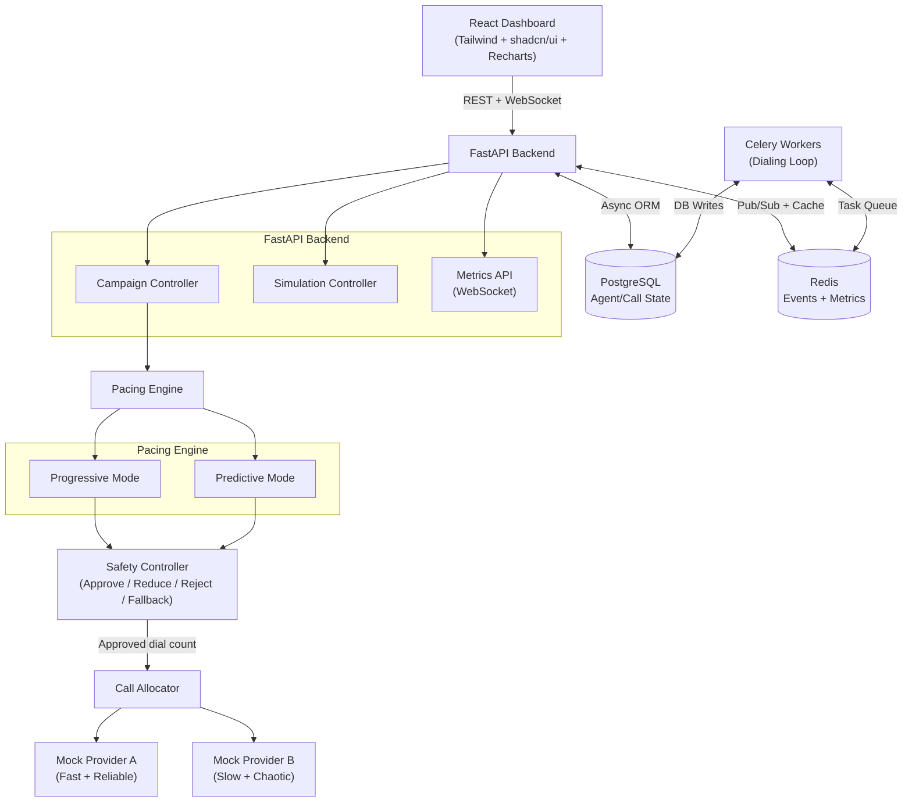
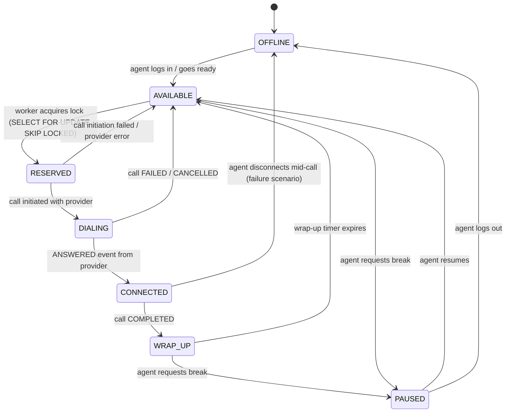
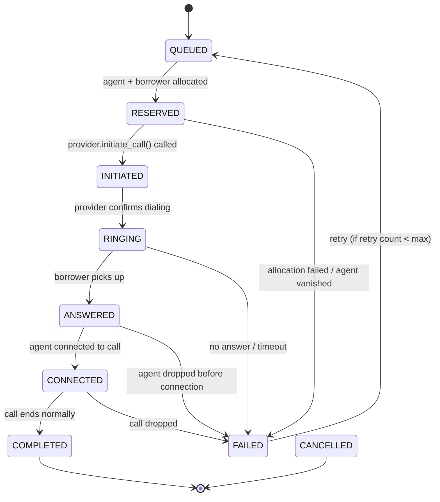

# SmartDialer — High Level Design

| Field | Value |
|---|---|
| Version | 1.0 |
| Date | 2026-08-19 |
| Status | Approved |

---

## 1. System Overview

SmartDialer is a collections call-center dialing prototype. It manages the full lifecycle of outbound calls — from campaign initiation through agent allocation, call setup, provider interaction, and post-call wrap-up — while enforcing strict safety and concurrency guarantees.

**Audience**: Engineers reviewing the architecture, contributing to the codebase, or evaluating the design.

---

## 2. Architecture Principles

| Principle | Description |
|---|---|
| **Simplicity over complexity** | No technology added just to look impressive. Every component earns its place. |
| **Correctness over cleverness** | A working progressive dialer beats a sophisticated ML model that causes abandoned calls. |
| **Explainability** | Every pacing decision must be logged with reasoning. No black boxes. |
| **Failure-first design** | The system is designed assuming workers crash, providers misbehave, and events arrive out of order. |
| **Safety isolation** | The Pacing Engine has no direct path to the telecom provider. The Safety Controller is a mandatory gate. |

---

## 3. High Level Architecture



---

## 4. Component Overview

| Component | Responsibility | Technology |
|---|---|---|
| **React Dashboard** | Real-time visualization of agent states, call metrics, pacing decisions, failure triggers | React 18, Tailwind, shadcn/ui, Recharts |
| **FastAPI Backend** | REST API, WebSocket streaming, request routing, session management | Python 3.11, FastAPI |
| **Campaign Controller** | Manages campaign lifecycle: create, start, stop, configure mode | FastAPI router + service |
| **Simulation Controller** | Triggers failure scenarios, controls simulation parameters | FastAPI router |
| **Pacing Engine** | Calculates how many calls to initiate in Progressive or Predictive mode | Python service |
| **Safety Controller** | Validates pacing requests; approves, reduces, rejects, or falls back | Python service |
| **Call Allocator** | Atomically binds agent + borrower + call + provider | Python service + PostgreSQL |
| **Mock Provider A** | Fast, reliable telecom simulation | Python async mock |
| **Mock Provider B** | Slow, chaotic, with duplicate/out-of-order events | Python async mock |
| **PostgreSQL** | Durable state for agents, calls, campaigns, borrowers, events | PostgreSQL 15 |
| **Redis** | Event pub/sub, answer rate tracking, distributed locks, metrics cache | Redis 7 |
| **Celery Workers** | Distributed dialing loop workers; multiple can run against the same campaign | Celery 5.3 + Redis broker |

---

## 5. Data Flow — Full Call Lifecycle

```
1. Campaign Manager starts campaign via Dashboard or API
2. Campaign Controller creates campaign record in PostgreSQL
3. Celery Dialer Worker wakes up (polling or triggered)
4. Worker calls Pacing Engine.calculate(campaign)
   - Progressive: count(AVAILABLE agents) → N
   - Predictive: formula using answer_rate, ringing_calls, provider_health → N
5. Pacing Engine sends N to Safety Controller.evaluate(N)
   - Safety Controller checks abandoned rate, provider health, ratio limits
   - Returns: approved_count (may be < N, or 0)
6. Call Allocator runs approved_count times:
   a. SELECT agent WHERE state=AVAILABLE FOR UPDATE SKIP LOCKED → reserve one agent
   b. SELECT borrower WHERE not yet called → reserve one borrower
   c. INSERT call record (state=RESERVED)
   d. Call TelecomProvider.initiate_call(borrower.phone)
   e. Update call state to INITIATED
7. Provider sends events back (RINGING, ANSWERED, COMPLETED, FAILED)
8. Event handler processes each event:
   - Checks idempotency (has this event been processed?)
   - Checks state validity (is this transition allowed from current state?)
   - Updates call + agent states accordingly
9. On COMPLETED/FAILED: agent moves to WRAP_UP → AVAILABLE
10. Metrics broadcaster sends updated stats to dashboard via WebSocket
```

---

## 6. Agent State Machine



### Concurrency Safety

The critical transition is `AVAILABLE → RESERVED`. Two Celery workers could see the same agent as AVAILABLE simultaneously.

**Solution**: PostgreSQL row-level locking.

```sql
SELECT id FROM agents
WHERE state = 'AVAILABLE' AND campaign_id = :campaign_id
LIMIT 1
FOR UPDATE SKIP LOCKED;
```

- `FOR UPDATE` acquires a write lock on the row
- `SKIP LOCKED` means a second worker skips already-locked rows instead of waiting
- Result: each worker gets a different agent; no double-reservation is physically possible

---

## 7. Call State Machine



### Idempotency

Every state transition checks: "Has this event's idempotency key already been processed?"  
If yes → skip silently, return current state.

### Out-of-Order Handling

Each transition has a `valid_from_states` guard. If `COMPLETED` arrives before `RINGING`, it is rejected (logged, not applied). The system remains in its last valid state.

---

## 8. Pacing Engine Design

### Progressive Mode

```python
def progressive_dial_count(campaign_id) -> int:
    available = count_agents(state=AVAILABLE, campaign=campaign_id)
    ringing   = count_calls(state__in=[INITIATED, RINGING], campaign=campaign_id)
    return max(0, available - ringing)
```

Simple invariant: never more calls in flight than available agents.

### Predictive Mode

```python
def predictive_dial_count(campaign_id) -> int:
    available_agents = count_agents(state=AVAILABLE, campaign=campaign_id)
    ringing_calls    = count_calls(state__in=[INITIATED, RINGING], campaign=campaign_id)
    connected_calls  = count_calls(state=CONNECTED, campaign=campaign_id)
    answer_rate      = get_rolling_answer_rate(campaign_id, window=100)  # last 100 calls
    provider_health  = get_provider_health_score()                        # 0.0 to 1.0

    # Expected connects from already-ringing calls
    predicted_connects = ringing_calls * answer_rate

    # Free agent slots
    headroom = available_agents - predicted_connects

    # How many calls to start to fill the headroom
    if answer_rate > 0:
        raw_count = headroom / answer_rate
    else:
        raw_count = available_agents  # fallback: treat as progressive

    # Scale down if provider is unhealthy
    dial_count = floor(raw_count * provider_health)

    return max(0, dial_count)
```

This value is passed to the Safety Controller — not directly to the provider.

---

## 9. Safety Controller Design

| Condition | Decision | Action |
|---|---|---|
| `abandoned_rate > 3%` | ❌ REJECT + FALLBACK | Return 0 calls; force progressive mode |
| `provider_health < 0.4` | ❌ REJECT | Return 0 calls; pause new dialing |
| `0.4 ≤ provider_health < 0.7` | ✂️ REDUCE | Return `floor(requested * provider_health)` |
| `requested > available_agents * 3` | ✂️ REDUCE | Cap at `available_agents * 2` |
| `all checks pass` | ✅ APPROVE | Return `requested` unchanged |

All decisions are logged with timestamp, reason, requested count, and approved count for audit.

---

## 10. Failure Handling Design

| Failure | Detection | Recovery |
|---|---|---|
| **Worker crash** | Heartbeat timestamp > 30s (cleanup job checks every 10s) | Release RESERVED agents back to AVAILABLE; requeue INITIATED calls to QUEUED |
| **Provider outage** | Consecutive timeouts > threshold; health score drops below 0.4 | Safety Controller rejects new calls; existing calls preserved until timeout |
| **Agent availability drop** | Pacing Engine re-queries agent count each cycle | Next pacing cycle (every ~2s) naturally dials fewer calls; over-dialing cannot persist |
| **Duplicate events** | Idempotency key checked in Redis/DB before processing | Duplicate silently ignored; current state preserved |
| **Out-of-order events** | State machine `valid_from_states` guard | Invalid transition rejected and logged; system stays in last valid state |

---

## 11. Scalability Considerations

| Scale | Bottleneck | Fix |
|---|---|---|
| **100 agents** | Single DB write path | Fine — no bottleneck at this scale |
| **1,000 agents** | PostgreSQL locking contention on agent reservation | Partition agents table by campaign; use Redis distributed locks as pre-filter |
| **10,000 agents** | Single PostgreSQL instance throughput; Celery broker becoming hot | Read replicas for state queries; Redis Cluster for broker; horizontal Celery scaling; consider sharding by campaign |

**What breaks first at 10,000 agents**: The `SELECT FOR UPDATE SKIP LOCKED` query on the agents table becomes a bottleneck as hundreds of workers contend for rows simultaneously. The fix is a two-phase approach: coarse-grained Redis set membership check (fast, approximate) followed by fine-grained DB lock (authoritative).

---

## 12. Technology Decision Records

| Decision | Chosen | Rejected | Reason |
|---|---|---|---|
| **State storage** | PostgreSQL | Redis-only | ACID guarantees required for agent reservation correctness |
| **Worker queue** | Celery + Redis | Kafka, RabbitMQ | Simpler ops for a prototype; Redis already present; easy to explain |
| **Pacing algorithm** | Rule-based statistical | ML model | Explainable, auditable, sufficient accuracy for prototype |
| **Frontend** | React + Tailwind + shadcn/ui | Streamlit, Dash | More polished UI; real-time WebSocket support; better visual presentation |
| **Provider integration** | Fully mocked | Plivo | Removes external dependency; full control over chaos scenarios |
| **Concurrency safety** | DB-level locking | Application-level mutex | DB lock survives worker crashes; application mutex does not |
