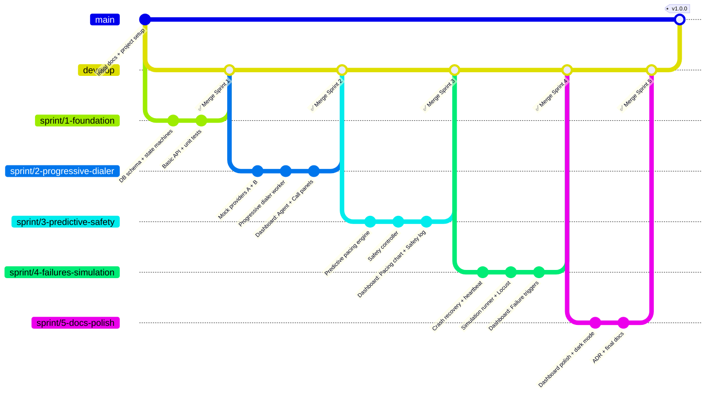

# SmartDialer — Implementation Plan

| Field | Value |
|---|---|
| Version | 1.0 |
| Date | 2026-08-19 |
| Status | Active |

---

## 1. Project Overview

SmartDialer is a functional prototype of a smart outbound call dialer for collections call-center environments. It supports two dialing modes (Progressive and Predictive), enforces safety constraints through an isolated Safety Controller, handles distributed concurrency, and demonstrates graceful failure recovery.

**Target**: Presentable, explainable, and locally runnable prototype — not a production system.  
**Stack**: Python 3.11 + FastAPI (backend), React 18 + Tailwind + shadcn/ui (frontend), PostgreSQL + Redis (data).

---

## 2. Evaluation Criteria Mapping

| Evaluation Area | Weight | Sprint | Component |
|---|---|---|---|
| System Design | 20% | All | Architecture pipeline, HLD.md, Safety Controller isolation |
| Distributed Systems & Concurrency | 15% | Sprint 1, 2 | `SELECT FOR UPDATE SKIP LOCKED`, Celery workers, Redis pub/sub |
| Predictive Pacing | 15% | Sprint 3 | `pacing_engine.py` — rule-based algorithm with reasoning |
| Safety & Correctness | 15% | Sprint 3 | `safety_controller.py` — 4 paths, bypass-proof by design |
| Progressive Dialing | 10% | Sprint 2 | `dialer_worker.py` — strict N:N enforcement |
| Failure Handling | 10% | Sprint 4 | All 5 scenarios: crash, outage, agent drop, duplicates, out-of-order |
| Testing & Performance | 10% | Sprint 1–4 | pytest throughout, Locust in Sprint 4 |
| Code Quality & Docs | 5% | Sprint 5 | Docstrings, README, ADR, all design docs |

---

## 3. Tech Stack (Finalized)

| Layer | Technology | Version | Purpose |
|---|---|---|---|
| Language | Python | 3.11 | Backend implementation |
| Web Framework | FastAPI | 0.104+ | REST API + WebSocket |
| ORM | SQLAlchemy (async) | 2.0 | Database access |
| Migrations | Alembic | 1.12+ | Schema versioning |
| Database | PostgreSQL | 15 | Durable state, ACID transactions |
| Cache / Broker | Redis | 7 | Pub/Sub, rate tracking, distributed locks |
| Task Queue | Celery | 5.3 | Distributed worker coordination |
| Frontend | React + Vite | 18 / 5 | Dashboard SPA |
| Styling | Tailwind CSS + shadcn/ui | 3.4 | Polished UI components |
| Charts | Recharts | 2.x | Real-time animated charts |
| Containers | Docker Compose | 3.8 | One-command local setup |
| Tests | pytest + pytest-asyncio | 7.x | Unit + integration |
| Load Test | Locust | 2.x | Performance testing |

---

## 4. GitHub Branching Strategy

### Branch Structure

```
main          ← stable releases (v1.0.0 tag at end)
develop       ← integration branch (all sprints merge here)
  ├── sprint/1-foundation
  ├── sprint/2-progressive-dialer
  ├── sprint/3-predictive-safety
  ├── sprint/4-failures-simulation
  └── sprint/5-docs-polish
```

### Git Flow Diagram



### PR Rules
1. Never push directly to `main` or `develop`
2. All sprint branches PR into `develop`
3. PRs require: tests passing, no merge conflicts
4. `develop` → `main` only at project completion with `v1.0.0` tag

---

## 5. Sprint Breakdown

---

### 🏁 Sprint 1 — Foundation & Core Models
**Branch**: `sprint/1-foundation`  
**Goal**: Running database, agent/call state machines with concurrency safety, and basic API  

#### Tasks
- [ ] **Project Setup**
  - [ ] Initialize backend Python project (`pyproject.toml` / `requirements.txt`)
  - [ ] Initialize frontend React project (Vite + Tailwind + shadcn/ui)
  - [ ] Write `docker-compose.yml` with postgres, redis, backend, worker, frontend
  - [ ] Write `backend/Dockerfile` and `frontend/Dockerfile`
  - [ ] Set up Alembic for migrations
  - [ ] Set up pytest with async fixtures

- [ ] **Database Schema**
  - [ ] `agents` table with all states and indexes
  - [ ] `calls` table with idempotency_key unique constraint
  - [ ] `campaigns` table
  - [ ] `borrowers` table
  - [ ] `call_events` audit table
  - [ ] Write and test Alembic migration

- [ ] **Agent State Machine**
  - [ ] `AgentState` enum + `VALID_AGENT_TRANSITIONS` dict
  - [ ] `reserve_agent()` with `SELECT FOR UPDATE SKIP LOCKED`
  - [ ] `transition_agent()` with guard checks
  - [ ] Unit tests: all valid transitions, all invalid transitions rejected
  - [ ] Concurrency test: 10 concurrent workers → each reserves different agent

- [ ] **Call State Machine**
  - [ ] `CallState` enum + `VALID_CALL_TRANSITIONS` dict
  - [ ] `process_provider_event()` with idempotency check + state guard
  - [ ] Unit tests: duplicate event → no double transition, out-of-order → rejected

- [ ] **Basic FastAPI Routes**
  - [ ] `GET/POST /api/agents`
  - [ ] `GET /api/calls`
  - [ ] `GET/POST /api/campaigns`
  - [ ] `GET /api/health`

- [ ] **React Shell**
  - [ ] Vite + React 18 + TypeScript setup
  - [ ] Tailwind CSS + shadcn/ui configured
  - [ ] Basic routing (Dashboard page placeholder)
  - [ ] API client (`lib/api.ts`) with Axios

#### Deliverables
- `docker compose up` → all services start
- `alembic upgrade head` → schema applied
- All state machine unit + concurrency tests passing
- Basic API accessible at http://localhost:8000/docs

#### Definition of Done
- [ ] All unit tests pass (`pytest tests/test_agent_state_machine.py tests/test_call_state_machine.py`)
- [ ] Concurrency test: zero double-reservations in 1000 parallel attempts
- [ ] Docker Compose starts cleanly
- [ ] API health check returns 200

#### Docs Produced This Sprint
- `docker-compose.yml` (done at setup)
- `.env.example`

---

### 🔧 Sprint 2 — Progressive Dialer + Telecom Mocks
**Branch**: `sprint/2-progressive-dialer`  
**Goal**: End-to-end progressive dialing working locally with mock providers  

#### Tasks
- [ ] **TelecomProvider Interface**
  - [ ] Abstract base class `TelecomProvider` with `initiate_call`, `cancel_call`, `get_call_status`, `get_health_score`
  - [ ] `ProviderCallResult` and `CallStatusResult` dataclasses

- [ ] **Mock Provider A** (Fast + Reliable)
  - [ ] 50–200ms latency, 2% failure rate
  - [ ] Ordered events: RINGING → ANSWERED → COMPLETED
  - [ ] `get_health_score()` → ~0.95

- [ ] **Mock Provider B** (Slow + Chaotic)
  - [ ] 500ms–3s latency, 15% failure rate + timeouts
  - [ ] 30% chance of duplicate events
  - [ ] 20% chance of out-of-order events
  - [ ] `get_health_score()` → degrades randomly

- [ ] **Call Allocator**
  - [ ] `allocate(campaign, provider, count)` with full rollback on failure
  - [ ] Agent reservation → Borrower reservation → Call record → Provider initiate
  - [ ] Handle: provider error mid-allocation (release agent + borrower)
  - [ ] Handle: agent disappears between query and reserve (SKIP LOCKED handles this)

- [ ] **Progressive Dialer Worker** (Celery Task)
  - [ ] `progressive_dial_count()` implementation
  - [ ] Main dialing loop: calculate → allocate → log
  - [ ] Heartbeat update on each cycle
  - [ ] Retry logic for failed calls (up to max_retries)

- [ ] **Failure: Call Failure**
  - [ ] Provider returns error → call → FAILED → agent → AVAILABLE
  - [ ] Retry if attempts < max_retries → call → QUEUED

- [ ] **Failure: Agent Disappears During Setup**
  - [ ] Agent goes OFFLINE between RESERVED and DIALING
  - [ ] Call returns to QUEUED for reallocation

- [ ] **Integration Tests**
  - [ ] Full happy path: QUEUED → COMPLETED, agent AVAILABLE at end
  - [ ] Call failure + retry
  - [ ] Provider A vs Provider B behavior differences

- [ ] **Dashboard: Agent Pool Panel**
  - [ ] `AgentPool` component with live state breakdown
  - [ ] Color-coded state badges
  - [ ] WebSocket hook connecting to `/ws/metrics`

- [ ] **Dashboard: Call Metrics Panel**
  - [ ] `CallMetrics` component: Initiated, Connected, Failed, Completed cards
  - [ ] Live updating from WebSocket

#### Deliverables
- Progressive dialing works end-to-end with both providers
- Both providers behave differently and demonstrably so
- Dashboard shows live agent states and call counts

#### Definition of Done
- [ ] Integration test: 10 agents, 100 borrowers, all calls complete, zero stuck agents
- [ ] Provider B test: verify duplicate events don't cause double transitions
- [ ] Dashboard updates in real time

---

### 🧠 Sprint 3 — Predictive Pacing + Safety Controller
**Branch**: `sprint/3-predictive-safety`  
**Goal**: Predictive mode working with an unbypassable Safety Controller  

#### Tasks
- [ ] **Answer Rate Tracker**
  - [ ] Redis sorted set storing last N call outcomes
  - [ ] `get_rolling_answer_rate(campaign_id, window=100)` → float
  - [ ] Handle cold-start (no history yet) → return None → trigger progressive fallback

- [ ] **Provider Health Scorer**
  - [ ] Track consecutive failures, response times
  - [ ] Exponential decay scoring: recent failures weighted more heavily
  - [ ] `get_score()` → 0.0–1.0

- [ ] **Predictive Pacing Engine**
  - [ ] `predictive_dial_count()` with full formula
  - [ ] Detailed logging: log every variable used in decision
  - [ ] Cold-start fallback to progressive

- [ ] **Safety Controller**
  - [ ] All 4 decision paths (APPROVE, REDUCE, REJECT, FALLBACK)
  - [ ] All decisions logged with timestamp + reason + counts
  - [ ] Tests proving: pacing engine cannot directly call provider

- [ ] **Mode Toggle**
  - [ ] Campaign mode switchable (PROGRESSIVE ↔ PREDICTIVE) while running
  - [ ] API endpoint: `PATCH /api/campaigns/{id}/mode`

- [ ] **Pacing Metrics Stream**
  - [ ] WebSocket message extended with pacing data: `dial_count_requested`, `dial_count_approved`, `answer_rate`, `provider_health`
  - [ ] Safety decision appended to stream: `action`, `reason`, `abandoned_rate`

- [ ] **Tests**
  - [ ] Safety controller: test all 4 paths with exact input conditions
  - [ ] Test: pacing engine can only get calls placed via safety controller (architecture test)
  - [ ] Test: answer_rate drops to 10% → safety controller reduces/rejects
  - [ ] Test: provider_health drops → correct safety action taken

- [ ] **Dashboard: Pacing Chart**
  - [ ] `PacingChart` — Recharts LineChart with 3 lines: dial_count, answer_rate %, provider_health %
  - [ ] Time-series data: last 60 seconds
  - [ ] Smooth animated updates

- [ ] **Dashboard: Safety Log**
  - [ ] `SafetyLog` — scrollable feed of safety controller decisions
  - [ ] Each row: timestamp + action badge (APPROVE=green, REDUCE=yellow, REJECT=red, FALLBACK=orange) + reason text

- [ ] **Dashboard: Mode Toggle**
  - [ ] Toggle switch in header: Progressive / Predictive
  - [ ] Calls `PATCH /api/campaigns/{id}/mode`

#### Deliverables
- Predictive mode running with observable pacing decisions
- Safety Controller rejecting/reducing based on simulated conditions
- Dashboard shows all pacing + safety data

#### Definition of Done
- [ ] Test: 0 abandoned calls above 3% with safety controller active
- [ ] Test: safety controller cannot be bypassed (architecture enforced)
- [ ] Dashboard pacing chart updating in real time

---

### 💥 Sprint 4 — Failure Handling + Simulation
**Branch**: `sprint/4-failures-simulation`  
**Goal**: All 5 failure scenarios demonstrated and recoverable  

#### Tasks
- [ ] **Worker Crash Recovery**
  - [ ] Celery Beat heartbeat task: runs every 10 seconds
  - [ ] Detects agents with `heartbeat_at` > 30s ago stuck in RESERVED/DIALING
  - [ ] Releases stale agents → AVAILABLE
  - [ ] Requeues orphaned calls → QUEUED
  - [ ] Test: simulate crash, verify recovery within 30s

- [ ] **Provider Outage Detection + Degradation**
  - [ ] Provider health score drops on consecutive failures
  - [ ] Safety Controller rejects new calls when `health < 0.4`
  - [ ] Existing connected calls continue until natural completion
  - [ ] Logging: "Provider outage detected — new calls paused"
  - [ ] Test: trigger outage, verify new calls stop, existing calls preserved

- [ ] **Agent Availability Drop**
  - [ ] Simulate 40 agents going OFFLINE suddenly
  - [ ] Verify pacing engine picks up lower available count within 1 cycle (2s)
  - [ ] Verify no over-dialing occurs
  - [ ] Test: measure time from drop to dialer reacting

- [ ] **Duplicate Event Idempotency**
  - [ ] Redis idempotency key check (fast path)
  - [ ] DB unique constraint on `call_events.idempotency_key` (fallback)
  - [ ] Test: send same ANSWERED event 5 times → state transitions exactly once

- [ ] **Out-of-Order Event Rejection**
  - [ ] State machine `valid_from_states` guards
  - [ ] Test: COMPLETED arrives before RINGING → rejected, state preserved
  - [ ] Test: Provider B out-of-order scenario → system stays consistent

- [ ] **Simulation Runner**
  - [ ] `POST /api/simulation/start` with params: `agent_count`, `borrower_count`, `mode`, `provider`, `answer_rate_override`
  - [ ] `POST /api/simulation/stop`
  - [ ] Scenario triggers: `worker-crash`, `provider-outage`, `agent-drop`
  - [ ] Simulation generates borrowers + agents on the fly

- [ ] **Locust Load Test**
  - [ ] `tests/load/locustfile.py`
  - [ ] Tasks: start simulation, poll metrics, trigger scenarios
  - [ ] Target: 100 virtual users, p95 < 500ms

- [ ] **Dashboard: Failure Scenario Panel**
  - [ ] `FailureScenarios` — 5 styled buttons with descriptions
  - [ ] Each button calls the trigger API + shows a toast notification
  - [ ] Disable buttons when simulation not running

- [ ] **Dashboard: Provider Health**
  - [ ] `ProviderHealth` — circular health indicators for A + B
  - [ ] Color: green ≥ 0.7, yellow 0.4–0.7, red < 0.4

- [ ] **Dashboard: Simulation Controls**
  - [ ] `agent_count` slider + `borrower_count` input
  - [ ] Mode toggle (Progressive / Predictive)
  - [ ] Provider selector (A or B)
  - [ ] Start / Stop buttons

#### Deliverables
- All 5 failure scenarios triggerable and visually demonstrable from dashboard
- Locust load test script running successfully
- Full simulation with configurable parameters

#### Definition of Done
- [ ] All 5 failure scenario tests passing
- [ ] Locust: 100 users, 60s, zero 5xx errors, p95 < 500ms
- [ ] Dashboard: all failure buttons working, health indicators updating

---

### 📦 Sprint 5 — Polish, Docs & Final Submission
**Branch**: `sprint/5-docs-polish`  
**Goal**: Submission-ready repository that anyone can run and explain  

#### Tasks
- [ ] **Dashboard Polish**
  - [ ] Dark / light mode toggle (Tailwind dark mode)
  - [ ] Smooth chart animations (Recharts `animationDuration`)
  - [ ] Responsive layout (works on 1920x1080 and 1366x768)
  - [ ] Empty state handling (when no simulation running)
  - [ ] Loading skeletons while WebSocket connects

- [ ] **Architecture Decision Record (ADR)**
  - [ ] Written in `docs/IMPLEMENTATION_PLAN.md` (Section 10)
  - [ ] Covers: PostgreSQL vs Redis-only, Celery vs custom workers, rule-based vs ML pacing, React vs Streamlit

- [ ] **Final Essay Answer**
  - [ ] Written in `README.md` and `docs/IMPLEMENTATION_PLAN.md`
  - [ ] Clear, concise, explains the core insight

- [ ] **README Finalization**
  - [ ] All setup steps verified (fresh machine test)
  - [ ] All code examples verified with copy-paste
  - [ ] Architecture image embedded correctly

- [ ] **Code Cleanup**
  - [ ] Docstrings on all public functions and classes
  - [ ] Remove debug print statements
  - [ ] Consistent logging format throughout
  - [ ] Type hints everywhere

- [ ] **Final End-to-End Test**
  - [ ] `docker compose up --build` on clean machine → all green
  - [ ] Run full pytest suite → all pass
  - [ ] Open dashboard → simulation works → failure scenarios trigger → metrics update
  - [ ] Run Locust → no errors

- [ ] **Git Tagging**
  - [ ] Merge `develop` → `main`
  - [ ] Tag `v1.0.0`
  - [ ] Push tag to GitHub

#### Definition of Done
- [ ] `docker compose up --build` works first time with zero manual steps
- [ ] All tests passing
- [ ] `v1.0.0` tag pushed to GitHub
- [ ] README accurately reflects the running system

---

## 6. Risk Register

| Risk | Probability | Impact | Mitigation |
|---|---|---|---|
| PostgreSQL locking causes deadlock under high concurrency | Low | High | Use `SKIP LOCKED` (not `WAIT`); comprehensive concurrency tests |
| Celery worker memory leak over long simulation | Medium | Medium | Set `--max-tasks-per-child=100` to recycle workers |
| React WebSocket reconnect causing metrics gaps | Medium | Low | Auto-reconnect in `useWebSocket` hook with exponential backoff |
| Docker Compose port conflicts on dev machine | Medium | Low | Document port requirements; allow env-var overrides |
| Provider B chaos causes test flakiness | Medium | Medium | Seed random in tests; mock chaos probability in test fixtures |

---

## 7. Definition of Done (Global — All Sprints)

- [ ] Code is committed to the sprint branch
- [ ] All new functions have docstrings
- [ ] New features have at least one unit test
- [ ] No failing tests (entire test suite green)
- [ ] `docker compose up` still works after changes
- [ ] PR description describes what changed and why

---

## 8. Final Essay Answer

> **"How would you build a SmartDialer that gets as much of the utilization benefit of predictive dialing as possible, while retaining the deterministic safety characteristics of progressive dialing?"**

The answer is architectural separation of concern: let the Pacing Engine be as aggressive as it wants to be in its estimates, but make the Safety Controller the only entity allowed to authorize actual calls.

The Pacing Engine runs in predictive mode — it looks at available agents, currently ringing calls, rolling answer rate, and provider health to estimate an optimal dial count. This estimate can be aggressive. It might say "start 25 calls for 20 available agents because our answer rate is 80%."

But this number goes to the Safety Controller, which enforces hard progressive-style invariants:
- Never let abandoned call rate exceed 3% (the progressive guarantee)
- Never start more calls than `available_agents × safety_multiplier` (bounded aggressiveness)
- Auto-fallback to strict 1:1 progressive mode if any health signal degrades

The key insight: **predictive dialing's main risk is abandoned calls**. If you enforce a hard cap on abandoned rate, you get the utilization benefit (dialing ahead by the right amount) without the compliance risk. The Safety Controller measures the actual abandoned rate in real time and reduces aggressiveness the moment the rate climbs.

This means on the happy path (stable answer rate, healthy provider), you get near-predictive utilization. On any edge case — provider degradation, sudden agent drop, answer rate collapse — the system immediately falls back toward progressive safety.

The Pacing Engine cannot bypass this. It has no direct path to the telecom provider. It is an advisor. The Safety Controller is the decision maker. This architectural constraint is the entire point.

---

## 9. Scalability Bottleneck Analysis

| Scale | Bottleneck | Root Cause | Fix |
|---|---|---|---|
| **100 agents** | None | Single DB handles this easily | No change needed |
| **1,000 agents** | PostgreSQL agent reservation contention | Many workers running `SELECT FOR UPDATE SKIP LOCKED` simultaneously on agents table | Partition agents table by campaign_id; add campaign-level Redis pre-filter |
| **10,000 agents** | PostgreSQL write throughput + Celery broker | 10K state transitions/sec exceeds single Postgres; Redis single-node broker saturates | Read replicas for state queries; Redis Cluster for broker; horizontal Celery scaling; consider sharding campaigns across DB instances |
| **100,000 agents** | Everything | Fundamental single-database bottleneck | Microservices split by domain (agent service, call service); event sourcing; distributed state machine |

**What breaks first at 10,000 agents**: The `SELECT FOR UPDATE SKIP LOCKED` becomes a write-heavy bottleneck as hundreds of concurrent workers fight for rows in the same campaign's agent pool. Adding a Redis set as a "soft reservation" pre-filter (remove agent ID from set before DB lock) dramatically reduces contention at the DB level.
